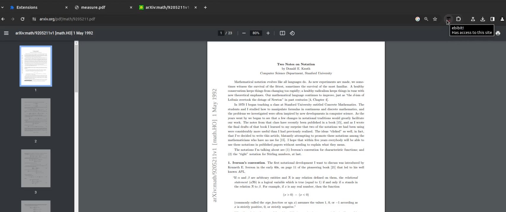
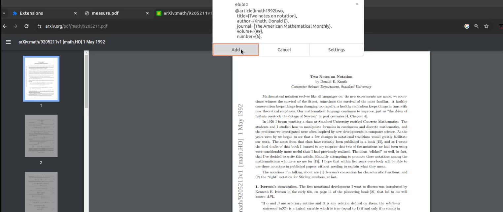
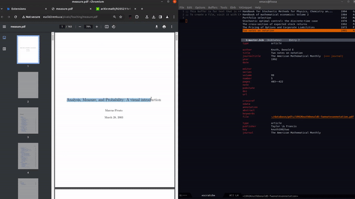

# ebibIt!

A Chrome extension for one click fetching of PDF's citation details to Emacs ebib using Google Scholar.

On any opened pdf, simply click the ebibIt extension icon to retrieve the BibTeX citation, ebibIt will then prompt to download the PDF and the citation details to your ebib pdf location and your provided BibTeX database respectively.

In case, the retrieved BibTeX details are incorrect, then you can also select the relevant text and right click through context menu to query the selected text instead.

This project arose to scratch a personal itch to have Zotero like features in ebib, hence may not have been in line with best practices, but suggestions/improvements are always welcome through PRs!

#### Note: You need to register a custom org-protocol to handle incoming messages from the browser and hence need to start Emacs as a server before using this extension. 
